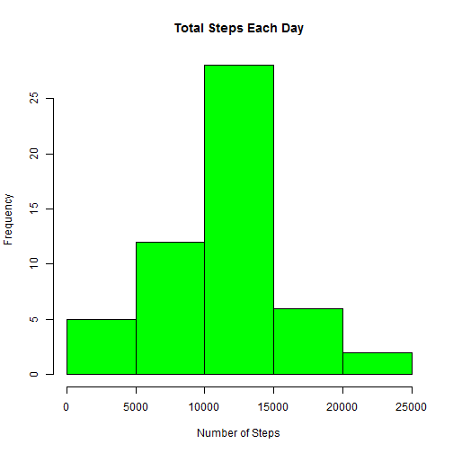
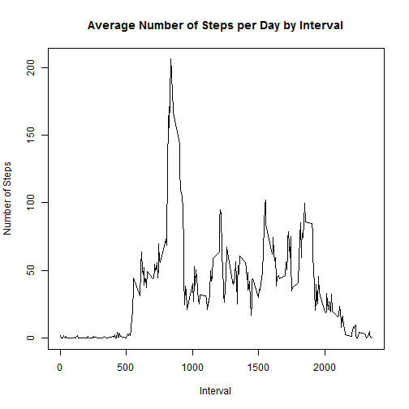
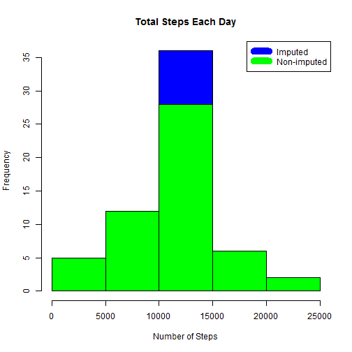

# Reproducible Research: Peer Assessment 1
Author: Rajesh Kolachana

## Loading and preprocessing the data
Download, unzip and load data into data frame `rawdata`.

```r
rm(list = ls())

if(!file.exists("repdata-data-activity.zip")) {
  temp <- tempfile()
  download.file("http://d396qusza40orc.cloudfront.net/repdata%2Fdata%2Factivity.zip",temp)
  unzip(temp)
  unlink(temp)
}

rawdata <- read.csv("activity.csv",header = TRUE,stringsAsFactors = FALSE)
```
## What is mean total number of steps taken per day?
Sum steps by day, create Histogram, and calculate mean and median as `steps_by_day_mean` and `steps_by_day_median`.

```r
steps_by_day <- aggregate(steps ~ date, rawdata, sum)
hist(steps_by_day$steps, main = paste("Total Steps Each Day"), col="green", xlab="Number of Steps")
```



```r
steps_by_day_mean <- mean(steps_by_day$steps)
steps_by_day_median <- median(steps_by_day$steps)

steps_by_day_mean
```

```
## [1] 10766.19
```

```r
steps_by_day_median
```

```
## [1] 10765
```
## What is the average daily activity pattern?
* Calculate average steps for each interval for all days.
* Plot the Average Number Steps per Day by Interval.
* Find interval with most average steps across all the days in the data set as `max_interval`

```r
steps_by_interval <- aggregate(steps ~ interval, rawdata, mean)
plot(steps_by_interval$interval,steps_by_interval$steps, type="l", xlab="Interval", ylab="Number of Steps",main="Average Number of Steps per Day by Interval")
```



```r
max_interval <- steps_by_interval$interval[which.max(steps_by_interval$steps)]

max_interval
```

```
## [1] 835
```
## Imputing missing values
A simple imputation approach is followed for this assignment. Missing values were imputed by replacing the missing value with the mean of steps across all days for that interval. 

```r
numberof_missing_values <- sum(is.na(rawdata))

numberof_missing_values
```

```
## [1] 2304
```

```r
imputed_data <- transform(rawdata, steps = ifelse(is.na(rawdata$steps), steps_by_interval$steps[match(rawdata$interval, steps_by_interval$interval)], rawdata$steps))
```

Recount total steps by day and create Histogram to show the difference due to imputation.

```r
steps_by_day_i <- aggregate(steps ~ date, imputed_data, sum)
hist(steps_by_day_i$steps, main = "Total Steps Each Day", col="blue", xlab="Number of Steps")

#Create Histogram to show difference. 
hist(steps_by_day$steps, main = "Total Steps Each Day", col="green", xlab="Number of Steps", add=T)
legend("topright", c("Imputed", "Non-imputed"), col=c("blue", "green"), lwd=10)
```



Calculate new mean and median for imputed data as `steps_by_day_mean_i` and `steps_by_day_median_i`.

```r
steps_by_day_mean_i <- mean(steps_by_day_i$steps)
steps_by_day_median_i <- median(steps_by_day_i$steps)

steps_by_day_mean_i
```

```
## [1] 10766.19
```

```r
steps_by_day_median_i
```

```
## [1] 10766.19
```

Calculate difference in mean and median between imputed and non-imputed data.

```r
mean_diff <- steps_by_day_mean_i - steps_by_day_mean
med_diff <- steps_by_day_median_i - steps_by_day_median

mean_diff
```

```
## [1] 0
```

```r
med_diff
```

```
## [1] 1.188679
```

Calculate total difference in steps due to imputation.

```r
total_diff <- round(sum(steps_by_day_i$steps) - sum(steps_by_day$steps),0)

total_diff
```

```
## [1] 86130
```

## Are there differences in activity patterns between weekdays and weekends?
Create a new factor variable in the dataset with two levels - "weekday" and "weekend" indicating whether a given date is a weekday or weekend day.

```r
weekdays <- c("Monday", "Tuesday", "Wednesday", "Thursday", "Friday")
imputed_data$dow = as.factor(ifelse(is.element(weekdays(as.Date(imputed_data$date)),weekdays), "Weekday", "Weekend"))
```

Make a panel plot containing a time series plot of the 5-minute interval (x-axis) and the average number of steps taken, averaged across all weekday days or weekend days (y-axis).

```r
steps_by_interval_i <- aggregate(steps ~ interval + dow, imputed_data, mean)

library(lattice)

xyplot(steps_by_interval_i$steps ~ steps_by_interval_i$interval|steps_by_interval_i$dow, main="Average Steps per Day by Interval",xlab="Interval", ylab="Steps",layout=c(1,2), type="l")
```


